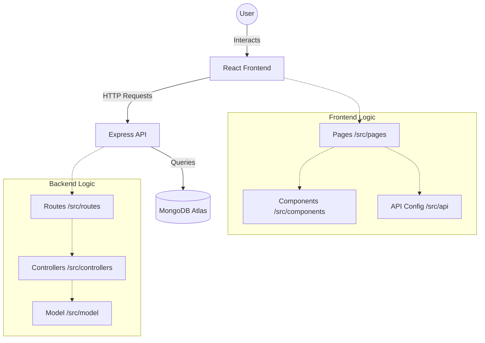

# ThinkBoard 📝

ThinkBoard is a modern, full-stack notes application designed for speed and simplicity. It features a sleek dark-themed UI built with React, Tailwind CSS, and DaisyUI, backed by a robust Node.js/Express API and MongoDB.

## 🚀 Features

- **Create Notes**: Quick and easy note creation with title and content.
- **Home Board**: A grid-based overview of all your notes, sorted by recency.
- **Detailed View**: Dedicated pages to read your notes in full.
- **Edit & Update**: Seamlessly modify your existing notes.
- **Delete**: Remove notes with a single click and confirmation.
- **Responsive Design**: Works beautifully on desktop and mobile.
- **Real-time Notifications**: Instant feedback with `react-hot-toast`.

## 🛠 Tech Stack

### Frontend

- **React 19** (Vite)
- **Tailwind CSS** & **DaisyUI**
- **Lucide React** (Icons)
- **React Router 7**
- **Axios** (API Client)

### Backend

- **Node.js** & **Express**
- **MongoDB** (via Mongoose)
- **CORS** & **Dotenv**
- **Nodemon** (Development)

## 🏗 Project Structure

```text
Thinkboard/
├── backend/                # Node.js API
│   ├── src/
│   │   ├── config/         # DB connection
│   │   ├── controllers/    # Request handlers
│   │   ├── model/         # Mongoose schemas
│   │   ├── routes/         # API endpoints
│   │   └── server.js       # Entry point
│   └── .env                # Environment variables
├── frontend/               # React Application
│   ├── src/
│   │   ├── api/            # Centralized API config
│   │   ├── components/     # Reusable UI parts
│   │   ├── pages/          # View components
│   │   ├── App.jsx         # Routing logic
│   │   └── main.jsx        # App entry point
│   └── vite.config.js
└── README.md
```

## 📊 System Architecture



## ⚙️ Setup & Installation

### 1. Clone the repository

```bash
git clone https://github.com/nibir404/Think-board.git
cd Think-board
```

### 2. Backend Setup

1. Navigate to the backend folder:
   ```bash
   cd backend
   ```
2. Install dependencies:
   ```bash
   npm install
   ```
3. Create a `.env` file and add your MongoDB connection string:
   ```env
   MONGO_URI=your_mongodb_uri
   PORT=5001
   ```
4. Start the server:
   ```bash
   npm run dev
   ```

### 3. Frontend Setup

1. Open a new terminal and navigate to the frontend folder:
   ```bash
   cd frontend
   ```
2. Install dependencies:
   ```bash
   npm install
   ```
3. Start the development server:
   ```bash
   npm run dev
   ```

The application will be available at `http://localhost:5173` (or the port Vite provides).

## 📄 License

This project is licensed under the ISC License.
